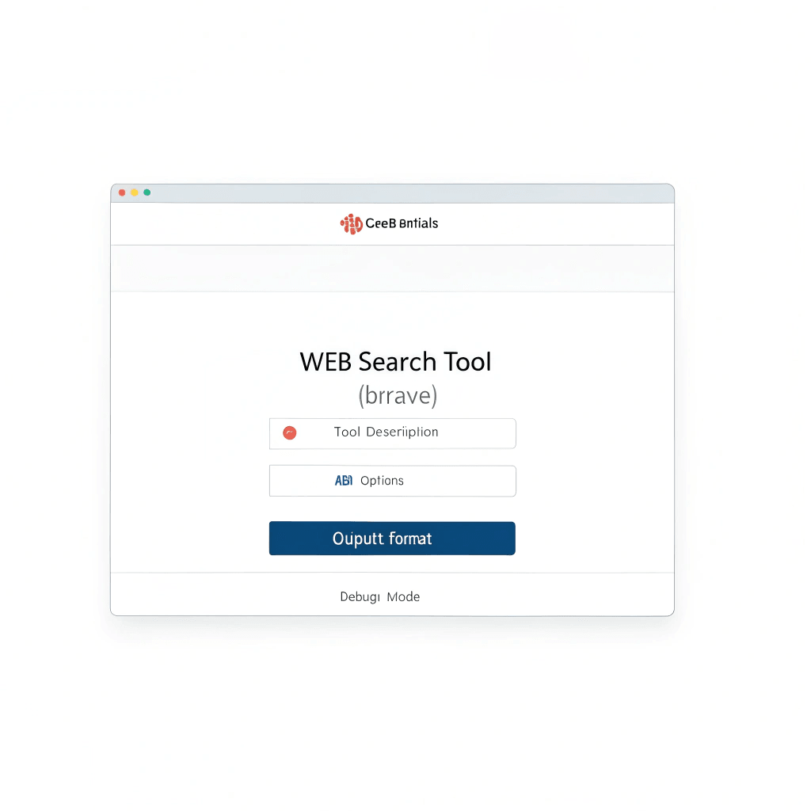

# n8n-nodes-bravesearch-advanced

This is an n8n community node package providing tools for interacting with the [Brave Search API](https://api.search.brave.com/).

It currently includes the following node:

*   **Web Search Tool (Brave):** Provides a LangChain-compatible tool for AI Agents and Chains to perform web searches using the Brave Search API.

[n8n](https://n8n.io/) is a fair-code licensed workflow automation platform.

[Installation](#installation)
[Operations](#operations)
[Credentials](#credentials)
[Compatibility](#compatibility)
[Usage](#usage)
[Resources](#resources)
[License](#license)

## Installation

Follow the [installation guide](https://docs.n8n.io/integrations/community-nodes/installation/) in the n8n community nodes documentation.

1.  Go to **Settings > Community Nodes**.
2.  Select **Install**.
3.  Enter `n8n-nodes-bravesearch-advanced` in the **Enter package name** field.
4.  Agree to the risks of using community nodes: select **I understand the risks, and I want to proceed**.
5.  Select **Install**.

After installing the node, you can use it like any other node. n8n displays the node in the node panel under **Community** > **Installed**.

## Operations

*   **Web Search Tool (Brave):**
    *   Provides a `DynamicStructuredTool` for use within n8n's AI Agent and Chain nodes.
    *   Accepts a search query (`q`) and optional parameters (like `country`, `search_lang`, `count`, `offset`, `safesearch`, `freshness`, `result_filter`, `extra_snippets`) defined by a Zod schema, allowing the AI model to control the search precisely.
    *   Allows overriding or setting default values for API parameters directly in the node's UI (`API Options`).
    *   Supports customizing the tool's description presented to the AI model.
    *   Offers different output formats for the search results string returned to the AI:
        *   `Simplified List`: A human-readable format with title, URL, and truncated snippet (recommended for most agents).
        *   `Raw JSON String`: The full JSON response from the Brave Search API.
    *   Includes a debug mode for logging request details and raw API responses.

## Credentials

Requires Brave Search API credentials.

1.  Sign up for the Brave Search API at [https://api.search.brave.com/](https://api.search.brave.com/).
2.  Obtain your API Subscription Token (API Key).
3.  In n8n, create new credentials for the **Web Search Tool (Brave)** node:
    *   Navigate to **Credentials** > **New**.
    *   Search for `Brave Search API` and select it.
    *   Enter a **Credential Name**.
    *   Paste your Brave Search API Subscription Token into the **API Key** field.
    *   (Optional) If using a custom endpoint (e.g., for testing or a proxy), enter it in the **Base URL** field. Otherwise, leave it blank to use the default `https://api.search.brave.com`.
4.  Save the credentials.

## Compatibility

Tested with n8n version 1.x. Requires n8n instances that support AI features (Agents/Chains).

## Usage

1.  Install the package in your n8n instance.
2.  Add the **Web Search Tool (Brave)** node to your workflow. This node typically connects to the **Tools** input of an AI Agent or Chain node.
3.  Select your configured **Brave Search API** credentials.
4.  Configure the node properties:
    *   **Tool Description:** Provide a clear description for the AI model explaining what the tool does, its inputs (query and optional parameters), and outputs (search results). The default description is a good starting point.
    *   **API Options (Optional):** Set default values or override specific API parameters (like `count`, `safesearch`, `country`, etc.) that the AI might provide. Parameters set here take precedence over the AI's input.
    *   **Output Format:** Choose between `Simplified List` (recommended) or `Raw JSON String` for the format of the results returned to the AI.
    *   **Debug Mode:** Enable if you need to inspect the exact API requests and responses during workflow execution.
5.  Connect the output of this node to the **Tools** input of your AI Agent or Chain node. The AI model can now invoke this `web_search` tool when it needs to search the web.

## Resources

*   [n8n Community Nodes documentation](https://docs.n8n.io/integrations/community-nodes/)
*   [Brave Search API Documentation](https://api-dashboard.search.brave.com/app/documentation/web-search/get-started)
*   [GitHub Repository: Walid-Azur/n8n-nodes-bravesearch](https://github.com/Walid-Azur/n8n-nodes-bravesearch)

## Consulting & Services

For custom node development, workflow automation consulting, or other n8n-related services, please contact:

**Walid Boudabbous** (Acceleate Consulting Estonia)
Email: [walid@acceleate.com](mailto:walid@acceleate.com)

## License

[MIT](LICENSE.md)
