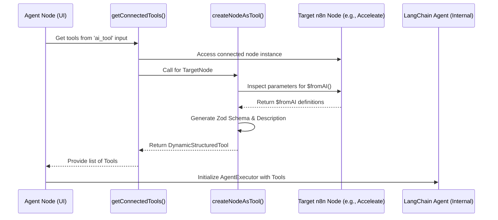
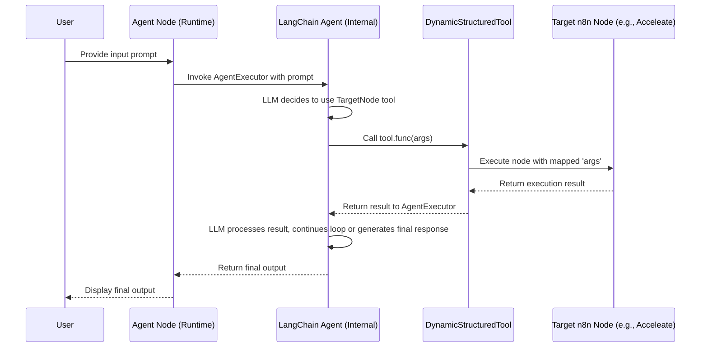

# n8n Agent and Tool Integration Flow

This document outlines the process by which n8n's AI Agent nodes integrate with and execute other n8n nodes as tools, based on reverse engineering the `@n8n/nodes-langchain` and `@n8n/core` packages.

## Overview

n8n utilizes the LangChain library to power its AI Agent nodes. The core concept involves dynamically wrapping standard n8n nodes (like HttpRequest, Google Sheets, or custom nodes like Acceleate) into LangChain-compatible `DynamicStructuredTool` objects. The Agent then uses these tools to perform actions based on user prompts.

## Key Components

1.  **Agent Node (`Agent.node.ts`):**
    *   Acts as a router, selecting the specific LangChain agent implementation (e.g., Tools Agent, Conversational Agent) based on user configuration.
    *   Defines input connection points, including `ai_tool` for connecting nodes that should be used as tools.
    *   Delegates the actual execution logic to specific agent files (e.g., `ToolsAgent/execute.ts`).

2.  **Tool Creation Utility (`create-node-as-tool.ts`):**
    *   Located in `@n8n/core`.
    *   Responsible for converting a standard n8n node into a `DynamicStructuredTool`.
    *   **`$fromAI(key, description, type)` Function:** This special function is the key mechanism. Developers use it within node parameter expressions (like default values or expressions) to mark parameters that should be exposed to the AI agent.
    *   **Schema Generation:** It parses the node's parameters, finds `$fromAI` calls, validates them, and generates a Zod schema defining the tool's expected input arguments for LangChain.
    *   **Description Generation:** It creates a description for the tool, either from a manual `toolDescription` parameter or automatically based on the node's resource/operation.
    *   **Tool Instantiation:** Creates a `DynamicStructuredTool` instance, providing the generated schema, description, and a `func`.

3.  **Agent Executor (`ToolsAgent/execute.ts` example):**
    *   Uses LangChain's `AgentExecutor`.
    *   Retrieves connected tools by likely calling `createNodeAsTool` for each node connected to the `ai_tool` input.
    *   Passes the list of `DynamicStructuredTool`s to the `AgentExecutor`.
    *   Handles the interaction loop: LLM decides action -> AgentExecutor identifies tool -> AgentExecutor calls the tool's `func`.

4.  **Tool Execution (`DynamicStructuredTool.func`):**
    *   The `func` defined during tool creation (by `createNodeAsTool`) is responsible for triggering the actual execution of the original n8n node.
    *   It receives the arguments (parsed according to the Zod schema) provided by the LangChain agent.
    *   It maps these arguments back to the corresponding `$fromAI` placeholders within the n8n node's parameters and executes the node's `execute` method.

## Data Flow Diagrams (Mermaid)

### 1. Tool Creation Flow (Agent Initialization)

### 2. Tool Execution Flow (Agent Runtime)

## Clarification on `supplyData`

Our analysis showed that `supplyData` is **not** the mechanism used for general tool data handling or dynamic UI population in standard nodes.

*   Its usage was found specifically within the `@n8n/nodes-langchain/nodes/code/Code.node.ts` file.
*   In that context, `code.supplyData.code` seems to access the code string entered by the user into the Code node's editor during the node's execution.

## Dynamic UI Options (`loadOptions`)

For dynamically populating UI elements like dropdowns (e.g., fetching a list of available Acceleate tools from an API), n8n nodes typically implement a `loadOptions` method within their property definitions. This method is called by the frontend editor and can execute asynchronous code to fetch and return the required options.

## Building Acceleate Tools for the Agent

To make `n8n-nodes-acceleate` nodes usable as tools:

1.  Identify parameters that the AI agent should control.
2.  Define these parameters using the `$fromAI(key, description, type)` function within their `expression` or `default` values.
    *   `key`: A unique, valid identifier (letters, numbers, `_`, `-`).
    *   `description`: A clear explanation for the LLM of what this parameter does.
    *   `type`: The expected data type ('string', 'number', 'boolean', 'object', 'array').
3.  Optionally, add a `toolDescription` parameter (string) and set `descriptionType: 'manual'` for fine-grained control over the tool's description presented to the agent.
